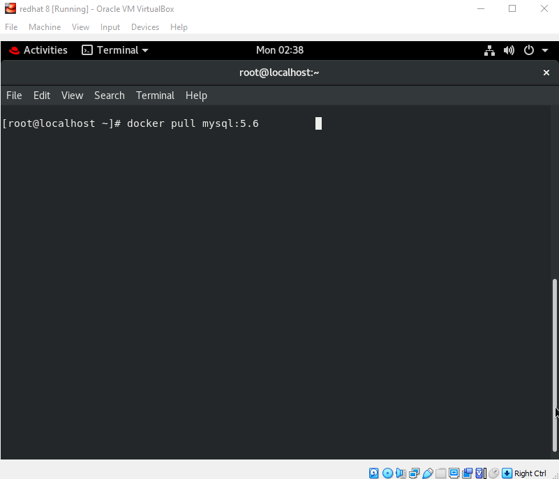
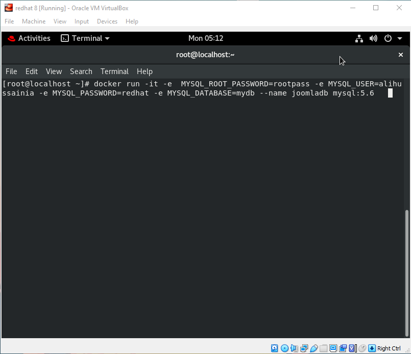
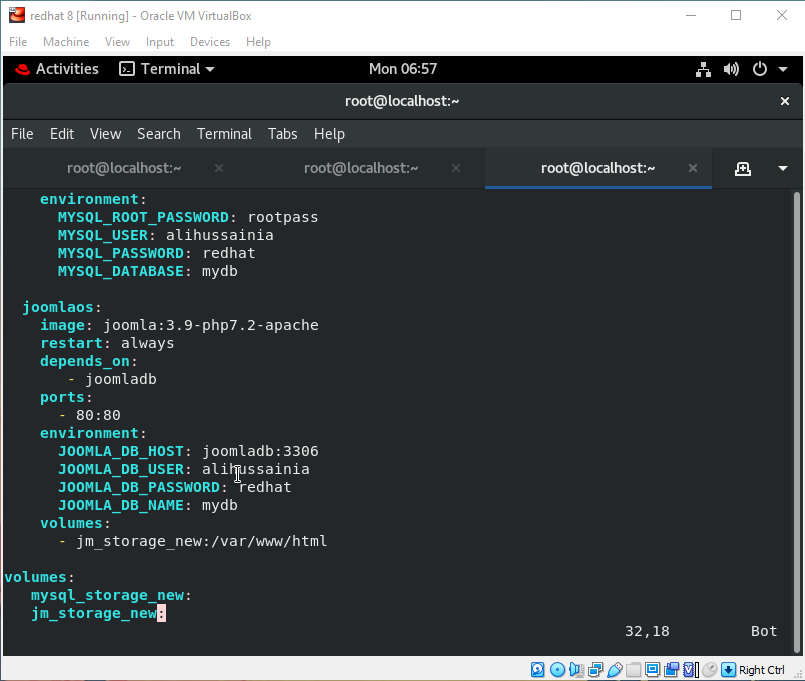
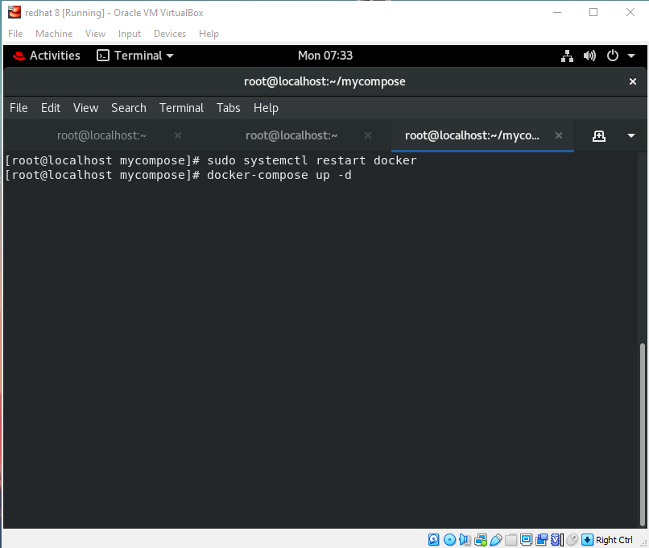
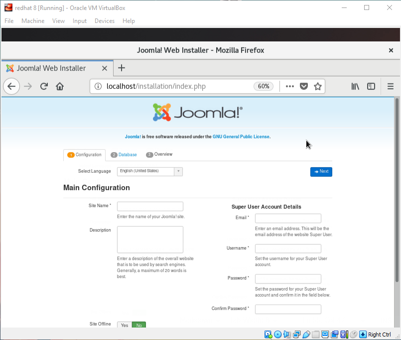

# Joomla on Docker
Under **IIEC-RISE 1.0** Campaign I learnt about Docker under the guidance of Vimal Daga Sir. This is my final project using Docker to set-up a WebApp called **Joomla**.
## I am going to explain the whole set-up process in this documentation.
## 1. Pre-configurations needed:
* I am using **RedHat Enterprise Linux**. Plus I have also installed Docker Software in it. You can use any OS and inside that OS you should have docker software installed. There might be a possibility that some Linux command might be different from other OS but I will explain what is the work of that command.
## 2. Setting up the required things:
* Disabling firewall:
  * Firewall might block some networking stuffs that's why I at first stopped the firewall.
  * Use `systemctl stop firewalld`.
* Starting the docker:
  * Use `systemctl start docker` to start Docker Service.
## 3. Downloading required images:
* Pulling MySQL Image:
  * Use `docker pull mysql:5.6` to download the **mysql version 5.6** image to use as a database server.
  * To know more about MySQL Image go to this page: https://hub.docker.com/_/mysql
* Pulling Joomla Image:
  * Use `docker pull joomla:3.9-php7.2-apache` to download the Joomla Image in which php and apache server is already preconfigured.
  * To know more about Joomla Image go to this page: https://hub.docker.com/_/joomla
  

## 4. Setting up MySQL:
* Use `docker run -it -e  MYSQL_ROOT_PASSWORD=(any password you like) -e MYSQL_USER=(any user name) -e MYSQL_PASSWORD=(any password(recommended not to use root password) -e MYSQL_DATABASE=(any database name) --name joomladb mysql:5.6` this code and it will create a user with a database inside Your MySQL Server.

* Now if you want to see is your database created or not then you have to install **MySQL cilent software** in your base OS. For that use `yum install mysql`. Next thing check your database server ip address and use that ip while running the client software. For reference check the image below.

## 5. Docker-Compose:
  * Before using Docker-Compose you should install the software. For reference go to this website : https://docs.docker.com/compose/install/
  * You can create and edit this file using vim editor. For that use `vim docker-compose.yml`. Remember the file name should always be **docker-compose.yml**.
  * In the below picture you can see the composed file. Let me tell you how it's done.
  

### version:
   * In each version the style and syntax are different. I used version 3 cause it's easy to compose than other versions.
### services:
   * In docker compose we use the term services to rectify which things will run when we start the compose file.
### container name:
   * **joomlaos** and **joomladb** are the name of the containers which will be setup. Docker-compose automatically creates the name for the containers using our defined container name. We just only have to tell that these containers we are using.
### image and restart:
   * **image** and **restart** these two key is used to specify which image we want to use and due to any reason if any of the container stops docker-compose will again restart it.
### volumes:
   * In docker as soon as we terminate an container our whole data inside that container destroyed. But if we want to make our data permanent then we have to use **docker volume**. Using the last volumes key we at first created two volumes. We know that MySQL and Joomla stores their data inside which folder. We simply make those folders permanent by mounting these volumes. That means due to any reason if our container terminated our data will not loose.
### environment:
   * There are many images in Docker which needs some pre-defined environment variables to run. That's why we need to pass these variables. One small thing to notice that in **joomlaos** I used **joomladb:3306** as host cause Joomla use this port number to connect with the host.
### depends_on and ports:
   * As we know Joomla needs MySQL database server to store there files that's why we are using **depends_on**. Also we know that we have to expose our container(where joomla running) to a specific port otherwise from outside world we will not be able to access our WebApp.
   
## 6. Docker-compose up:
  * As per the below mentioned picture use `docker-compose up -d` to complete the setup.
  

## 7. Joomla Started:
  * Got to your browser and type `localhost:80` and done you will be able to see your Joomla WebApp. Now one small suggestion that you can use directly `localhost` without typing the port cause in http apache server our browser by default use the port 80. But if you want to use any other port then you have to mention it in your docker-compose file.
  

## 8. Docker-compose start stop and down:
   * After using docker compose up now in one click you can stop your whole setup. Just use `docker-compose stop`. Again you want to start the service use `docker compose start` and you can easily stop the containers using `docker compose down` command.
   

## Troubleshooting and Solves:
  #### There might be a possibility that you may face some troubleshoots. As we know in these kinds of automations are depended on many things and suppose any of the dependency might not accurate. Here are some suggestions:
   * After you restart your base OS you will see problem cause previous time you stopped your firewall and after system restart firewall will start again. So before again starting docker-compose you should stop firewall. You can check the status of your firewall using `systemctl status firewalld`. If you want to permanently disable firewall you can use `systemctl disable firewalld`.
   * Next problem might happen after you setup your MySQL you up your docker compose and your joomla might not get the connection with MySQL. It's probably because there are limitations that how much container you can connect with your database server. I don't know anything about database handling but as per my knowledge after setting up the MySQL user and database name run this command `docker rm -f $(docker ps -aq)` . This command will remove all the previous containers. Otherwise you can also use `docker ps -a` to see which container is running on MySQL server and you can remove that particular container using `docker rm (container id)`.
   * Next problem might happen like your joomla is unable to connect to database server. It's probably because your iptables doesn't get updated as soon as you do the previously mentioned action. So final and last solution is that you should at first remove the containers create previously by docker compose and then restart your docker using `systemctl restart docker` and now you just up the docker-compose and it will work fine. 
## Future possibilities:
   ### This whole setup is done in local machine. But exactly same thing we can do in cloud to setup a Joomla WebApp. We can use many cloud services like Google Cloud, Digital Ocean etc. for this.
   
## References:
  
[YouTube playlist](https://www.youtube.com/playlist?list=PLAi9X1uG6jZ30QGz7FZ55A27jPeY8EwkE)
 
[raktim00](https://github.com/raktim00/IIEC_Docker_Project_on_Joomla)
 
[sql yum repo](https://dev.mysql.com/downloads/repo/yum/)
 
[github issues](https://github.com/wodby/docker4drupal/issues/211)
 
[vim cmds](https://linuxize.com/post/how-to-save-file-in-vim-quit-editor/)

  
## Attendance:

[Session 1](Screenshots/1.png)

[Session 2](Screenshots/2.png)

[Session 3](Screenshots/3.png)

[Session 4](Screenshots/4.png)

[Session 5](Screenshots/5.png)

[Session 6](Screenshots/6.png)

## Blog

<a target=_blank src="https://alihussainia.github.io/">Blog Link</a>
